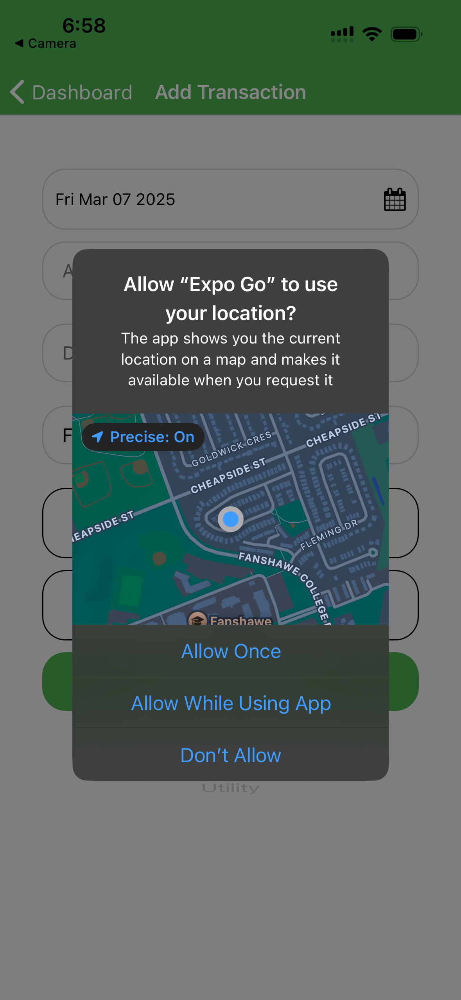
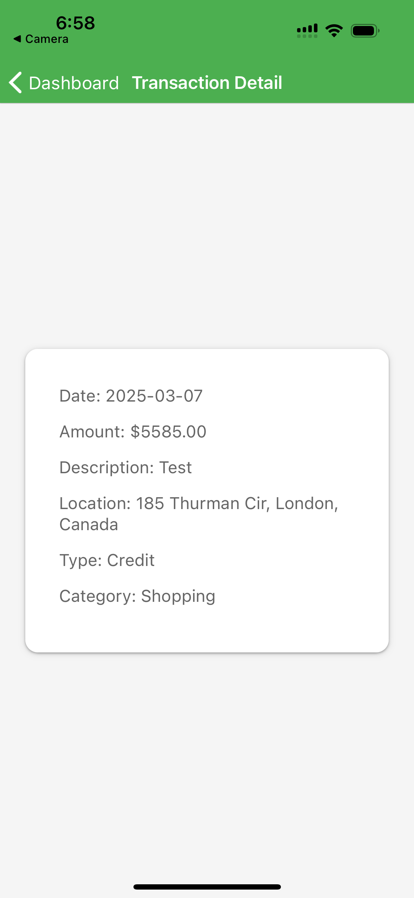

> Why do I have a folder named ".expo" in my project?
The ".expo" folder is created when an Expo project is started using "expo start" command.
> What do the files contain?
- "devices.json": contains information about devices that have recently opened this project. This is used to populate the "Development sessions" list in your development builds.
- "settings.json": contains the server configuration that is used to serve the application manifest.
> Should I commit the ".expo" folder?
No, you should not share the ".expo" folder. It does not contain any information that is relevant for other developers working on the project, it is specific to your machine.
Upon project creation, the ".expo" folder is already added to your ".gitignore" file.

# Expense Tracker

## Overview
This is a simple expense tracker application that helps you manage your expenses efficiently.

## Features
- Add new expenses
- View expense history
- Categorize expenses
- Generate expense reports

## Screenshots

### Dashboard


### Expense Entry


## Installation
1. Clone the repository:
    ```sh
    git clone https://github.com/yourusername/ExpenseTracker.git
    ```
2. Navigate to the project directory:
    ```sh
    cd ExpenseTracker
    ```
3. Install the dependencies:
    ```sh
    npm install
    ```

## Usage
1. Start the application:
    ```sh
    npm start
    ```
2. Open your browser and navigate to `http://localhost:3000`.

## Contributing
Feel free to submit issues and enhancement requests.

## License
This project is licensed under the MIT License.
